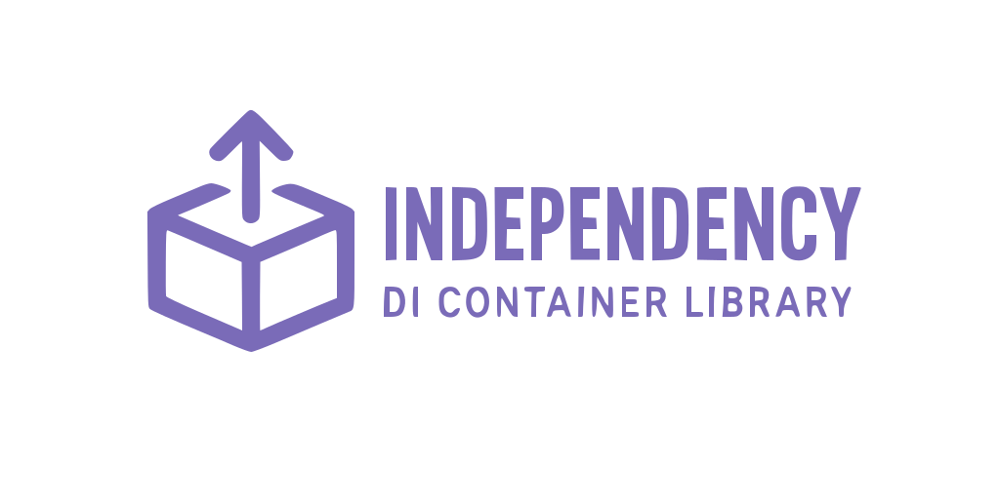

<p align="center">

</p>

<p align="center">
A modern, type-safe dependency injection container for Python 3.10+
</p>

---

Unlike many other Python DI containers, Independency operates in the local scope with no global state. It's inspired by [punq](https://github.com/bobthemighty/punq) with a similar API, enhanced with full support for generics, advanced typing, and comprehensive testing utilities.

## Features

- **No Global State**: Explicit container creation, no hidden dependencies
- **Type Safety**: Full support for generics, type hints, and static type checking
- **Modern Python**: Built for Python 3.10+ with modern typing features (PEP 585)
- **Flexible Registrations**: Singleton and transient scopes, factory functions
- **Testing Support**: Built-in `TestContainer` for easy dependency mocking
- **Build-time Validation**: Dependency graph validation with cycle detection
- **String Keys**: Support for string-based dependency registration
- **Self-injection**: Container can be injected as a dependency

## Installation

```bash
pip install independency
```

## Quick Start

```python
import independency

builder = independency.ContainerBuilder()
# register application dependencies
container = builder.build()
obj: SomeRegisteredClass = container.resolve(SomeRegisteredClass)
```

## Usage

### Registering Dependencies

```python
# Transient: creates new object on each resolve
builder.register(User, User)

# Singleton: creates object only once
builder.singleton(User, User)

# Generics support
builder.singleton(Storage[int], Storage[int])
builder.singleton(Storage[str], Storage[str])

# String-based registration
builder.singleton('special_storage', Storage[int])
```

### Factory Functions

The second argument is a factory, so you can provide any callable:

```python
def create_db(config: Config) -> Database:
    return Database(config.dsn)

builder.singleton(Config, Config)
builder.singleton(Database, create_db)
```

### Explicit Dependencies

Use `Dependency` to pass specific dependencies to a factory:

```python
from independency import Dependency as Dep

builder.singleton('primary_db', Database, dsn='postgresql://primary')
builder.singleton('cache_db', Database, dsn='redis://cache')
builder.singleton(UserService, db=Dep('primary_db'))
builder.singleton(CacheService, db=Dep('cache_db'))
```

### Testing with Overrides

Independency provides a specialized `TestContainer` for easy mocking in tests:

```python
# Create your production container
container = builder.build()

# Create a test container with overrides
test_container = container.create_test_container()
test_container = test_container.with_overridden_singleton(
    Database,
    MockDatabase
)

# Use in tests
service = test_container.resolve(UserService)  # Gets MockDatabase injected
```

## Examples

### Basic HTTP Client

```python
import requests
from independency import Container, ContainerBuilder


class Config:
    def __init__(self, url: str):
        self.url = url


class Getter:
    def __init__(self, config: Config):
        self.config = config

    def get(self):
        return requests.get(self.config.url)


def create_container() -> Container:
    builder = ContainerBuilder()
    builder.singleton(Config, Config, url='http://example.com')
    builder.singleton(Getter, Getter)
    return builder.build()


def main():
    container = create_container()
    getter: Getter = container.resolve(Getter)
    print(getter.get().status_code)


if __name__ == '__main__':
    main()
```

### Multiple Instances with String Keys

When you need multiple instances of the same type:

```python
from independency import Container, ContainerBuilder, Dependency as Dep


class Queue:
    def __init__(self, url: str):
        self.url = url

    def pop(self):
        ...


class Consumer:
    def __init__(self, q: Queue):
        self.queue = q

    def consume(self):
        while True:
            message = self.queue.pop()
            # process message


def create_container() -> Container:
    builder = ContainerBuilder()
    builder.singleton('first_q', Queue, url='http://example.com')
    builder.singleton('second_q', Queue, url='http://example2.com')
    builder.singleton('c1', Consumer, q=Dep('first_q'))
    builder.singleton('c2', Consumer, q=Dep('second_q'))
    return builder.build()


def main():
    container = create_container()
    consumer: Consumer = container.resolve('c1')
    consumer.consume()


if __name__ == '__main__':
    main()
```

## API Reference

### ContainerBuilder

- `register(key, factory, **kwargs)` - Register a transient dependency (new instance per resolve)
- `singleton(key, factory, **kwargs)` - Register a singleton dependency (single instance)
- `build()` - Build and validate the container

### Container

- `resolve(key)` - Resolve a dependency by type or string key
- `create_test_container()` - Create a test container from this container

### TestContainer

- `with_overridden_singleton(key, factory, **kwargs)` - Override a dependency for testing
- `resolve(key)` - Resolve a dependency (same as Container)

## Development

### Setup

```bash
# Install uv if you don't have it
pip install uv

# Install dependencies
uv sync --extra dev
```

### Running Tests

```bash
make tests  # Run pytest with 100% coverage requirement
make lint   # Run all linters (flake8, mypy, pylint, black)
make pretty # Format code with black
```

## Requirements

- Python 3.10 or higher
- No runtime dependencies (only dev dependencies for testing)

## Contributing

Contributions are welcome! Please:

1. Fork the repository
2. Create a feature branch
3. Make your changes with tests
4. Ensure `make tests` and `make lint` pass
5. Submit a pull request

If you find a bug or have a feature request, please open an issue on [GitHub](https://github.com/Apollon76/independency).

## License

See the LICENSE file for details.

## Credits

Inspired by [punq](https://github.com/bobthemighty/punq) - a similar dependency injection library for Python.
